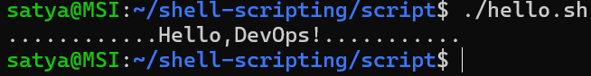
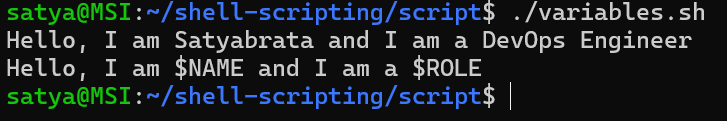
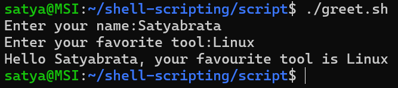
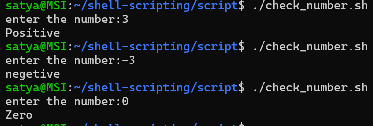
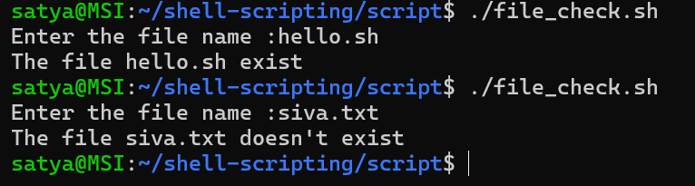

Shell Scripting Basics

## Task 1: Your First Script
1. Create a file `hello.sh`
2. Add the shebang line `#!/bin/bash` at the top
3. Print `Hello, DevOps!` using `echo`
4. Make it executable and run it

[Script](scripts/hello.sh)

* What happens if you remove the shebang line?
 - The script runs after removing shebang line :
    - `./hello.sh` - When we run the script directly, the kernel checks for a shebang to identify the interpreter.If no shebang is found, the script is executed using the current shell.

    - `bash hello.sh` - The script is explicitly executed by the Bash shell.It works even if the shebang is missing.The shebang is ignored in this case because you manually specified the interpreter.
    - `sh hello.sh` - The script is executed using the sh shell. sh may behave differently from bash.

---

### Task 2: Variables
1. Create `variables.sh` with:
   - A variable for your `NAME`
   - A variable for your `ROLE` (e.g., "DevOps Engineer")
   - Print: `Hello, I am <NAME> and I am a <ROLE>`

[Script](scripts/variables.sh)

2. Try using single quotes vs double quotes — what's the difference?
 * Using double quote `" "` - Allow **variable expansion** (variables work)
 * Using single quote `' '` - print exactly what you type

### Task 3: User Input with read
1. Create `greet.sh` that:
   - Asks the user for their name using `read`
   - Asks for their favourite tool
   - Prints: `Hello <name>, your favourite tool is <tool>`

[Script](scripts/greet.sh)

### Task 4: If-Else Conditions
1. Create `check_number.sh` that:
   - Takes a number using `read`
   - Prints whether it is **positive**, **negative**, or **zero**

[Script](scripts/check_number.sh)

2. Create `file_check.sh` that:
   - Asks for a filename
   - Checks if the file **exists** using `-f`
   - Prints appropriate message

[Script](scripts/file_check.sh)

### Task 5: Combine It All
Create `server_check.sh` that:
1. Stores a service name in a variable (e.g., `nginx`, `sshd`)
2. Asks the user: "Do you want to check the status? (y/n)"
3. If `y` — runs `systemctl status <service>` and prints whether it's **active** or **not**
4. If `n` — prints "Skipped."

[Script](scripts/server_check.sh)

