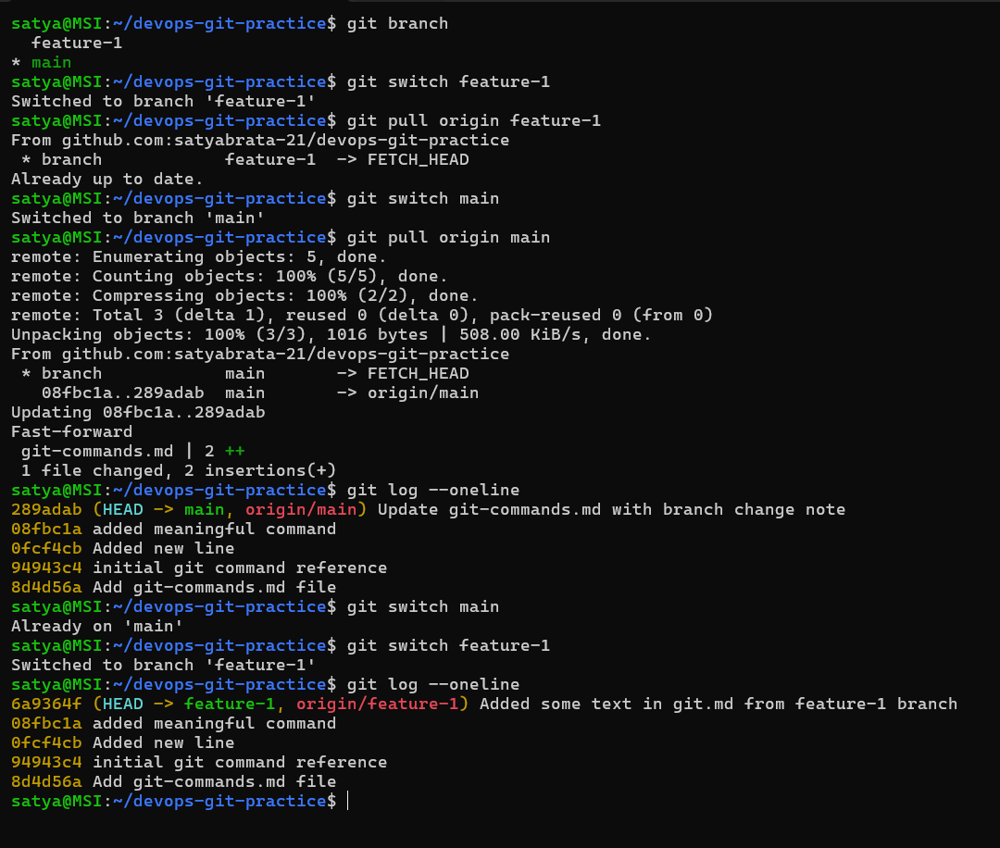

# Day 23 – Git Branching & Working with GitHub

## Challenge Tasks

### Task 1: Understanding Branches
Answer these in your `day-23-notes.md`:
1. What is a branch in Git?

- A branch in Git is a separate line of development. 
- It allows you to work on new features or fixes without affecting the main project.

2. Why do we use branches instead of committing everything to `main`?

- We use branches to keep development safe, organized, and collaborative.which always holds the stable,production-ready code.
 Reasons:
- Avoid breaking the main code : If a feature has bugs, it won't affect main.
- Work on multiple features simultaneously : Different developers can work on different branches.
- Easy testing before merging : After testing, the branch can be merged into main.

3. What is `HEAD` in Git?
- `HEAD` is a pointer that indicates the current branch or commit you are working on.
- It helps Git know where you are in the commit history and which branch you are on.

4. What happens to your files when you switch branches?
- When you switch branches, Git updates your working directory to match the state of the branch you switched to.
- If there are uncommitted changes that conflict with the branch you're switching to, Git will prevent the switch and ask you to either commit or stash your changes first.

---

### Task 2: Branching Commands — Hands-On
In your `devops-git-practice` repo, perform the following:
1. List all branches in your repo
2. Create a new branch called `feature-1`
3. Switch to `feature-1`
4. Create a new branch and switch to it in a single command — call it `feature-2`
5. Try using `git switch` to move between branches — how is it different from `git checkout`?
6. Make a commit on `feature-1` that does **not** exist on `main`
7. Switch back to `main` — verify that the commit from `feature-1` is not there
8. Delete a branch you no longer need
9. Add all branching commands to your `git-commands.md`

.png)
.png)
---

### Task 3: Push to GitHub
1. Create a **new repository** on GitHub (do NOT initialize it with a README)
2. Connect your local `devops-git-practice` repo to the GitHub remote
3. Push your `main` branch to GitHub
4. Push `feature-1` branch to GitHub
5. Verify both branches are visible on GitHub
6. Answer in your notes: What is the difference between `origin` and `upstream`?
- `origin` is the default name of the remote repository you cloned from.
- It usually points to your repository on a platform like GitHub.You normally push and pull code from origin.
- `upstream` refers to the original repository from which your fork was created.
- It is commonly used when contributing to open-source projects.
- Example scenario:
 . You fork a project from GitHub.
 . Your fork → origin
 . Original repo → upstream

.png)
.png)

---

### Task 4: Pull from GitHub
1. Make a change to a file **directly on GitHub** (use the GitHub editor)
2. Pull that change to your local repo
3. Answer in your notes: What is the difference between `git fetch` and `git pull`?
- `git fetch` retrieves the latest changes from the remote repository but does not merge them into your local branch. It updates your remote tracking branches.
- `git pull` is a combination of `git fetch` followed by `git merge`. It retrieves the latest changes and automatically merges them into your current branch.
- Use `git fetch` when you want to review changes before merging, and use `git pull` when you want to quickly update your local branch with the latest changes from the remote repository.




---

### Task 5: Clone vs Fork
1. **Clone** any public repository from GitHub to your local machine
.png)
2. **Fork** the same repository on GitHub, then clone your fork
.png)
3. Answer in your notes:

i. What is the difference between clone and fork?

- Cloning creates a local copy of a repository on your machine. It allows you to work on the code locally and push changes back to the original repository if you have permission.
- Forking creates a copy of a repository under your GitHub account. It allows you to make changes to the code without affecting the original repository. You can then submit a pull request to propose your changes to the original repository.

ii.  When would you clone vs fork?

- You would clone a repository when you want to contribute to a project that you have write access to, or when you want to work on a project for personal use without needing to submit changes back to the original repository.
- You would fork a repository when you want to contribute to an open-source project that you do not have write access to, or when you want to create your own version of a project to make changes without affecting the original repository.

iii. After forking, how do you keep your fork in sync with the original repo?

- After forking, you can keep your fork in sync with the original repository by adding the original repository as a remote (often named `upstream`) and regularly fetching and merging changes from it. The commands are:
```bash
git remote add upstream https://github.com/original-owner/original-repo.git
git fetch upstream
git merge upstream/main
``` 