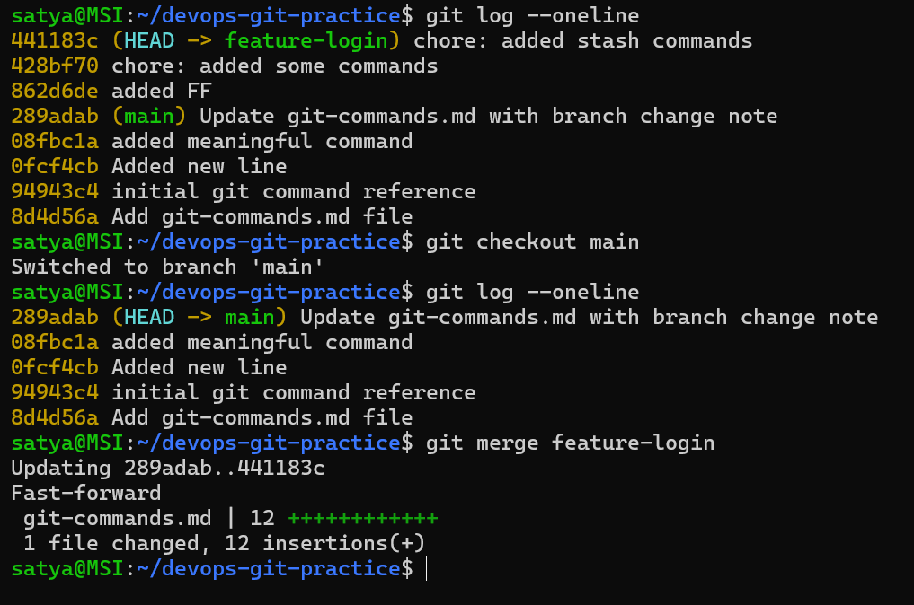
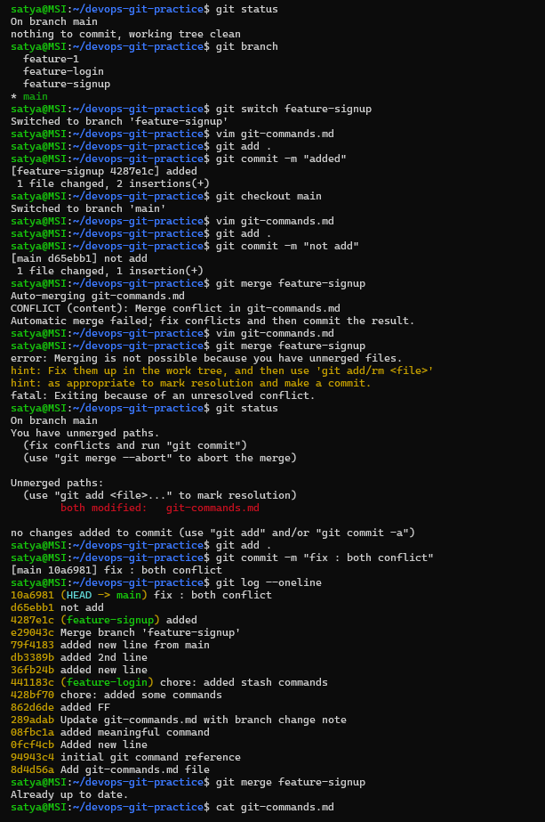

# Day 24 – Advanced Git: Merge, Rebase, Stash & Cherry Pick

## Challenge Tasks

## Expected Output
- A markdown file: `day-24-notes.md` with your observations and answers
- Continue updating `git-commands.md` in your `devops-git-practice` repo

### Task 1: Git Merge — Hands-On
1. Create a new branch `feature-login` from `main`, add a couple of commits to it
.png)

2. Switch back to `main` and merge `feature-login` into `main`
.png)
or
  

3. Observe the merge — did Git do a **fast-forward** merge or a **merge commit**?
- fast-forward

4. Now create another branch `feature-signup`, add commits to it — but also add a commit to `main` before merging
.png)

5. Merge `feature-signup` into `main` — what happens this time?
- Git creates a merge commit because `main` has moved ahead with a new commit, so it cannot fast-forward.
.png)
or 

6. Answer in your notes:

   - What is a fast-forward merge?
   - Fast-forward merge = Git simply moves the branch pointer forward because there are no separate commits in the target branch.

   - When does Git create a merge commit instead?
    -  Git creates a merge commit when both branches have different commits and Git needs to combine them.

   - What is a merge conflict? (try creating one intentionally by editing the same line in both branches)

- A merge conflict happens when Git cannot automatically combine changes from two branches.
- This usually occurs when the same file or same line is changed in both branches.
- Git will mark the conflict in the file and require manual intervention to resolve it.
---

### Task 2: Git Rebase — Hands-On
1. Create a branch `feature-dashboard` from `main`, add 2-3 commits
.png)
2. While on `main`, add a new commit (so `main` moves ahead)
.png)
3. Switch to `feature-dashboard` and rebase it onto `main`
.png)
or
.png)

4. Observe your `git log --oneline --graph --all` — how does the history look compared to a merge?
.png)
5. Answer in your notes:
   - What does rebase actually do to your commits?
- Rebase takes all the commits from your current branch and reapplies them on top of another branch (in this case, `main`).
- git rebase takes your commits and replays them on top of another branch.

   - How is the history different from a merge?
    - Rebase creates a cleaner, linear history without merge commits, while merge creates a more complex history with merge commits.

   - Why should you **never rebase commits that have been pushed and shared** with others?
   - You should never rebase pushed/shared commits because rebase changes commit history and commit IDs, which can break other people's work.

   - When would you use rebase vs merge?
    - Use `rebase` when you want a clean, linear commit history.
    - Use `merge` when you want to preserve the branch history.

---

### Task 3: Squash Commit vs Merge Commit
1. Create a branch `feature-profile`, add 4-5 small commits (typo fix, formatting, etc.)
.png)
2. Merge it into `main` using `--squash` — what happens?
.png)
3. Check `git log` — how many commits were added to `main`?
.png)
- Only 1 commit was added to `main` because `--squash` combines all the commits from `feature-profile` into a single commit.
4. Now create another branch `feature-settings`, add a few commits
.png)
5. Merge it into `main` **without** `--squash` (regular merge) — compare the history
.png)
6. Answer in your notes:
   - What does squash merging do?
- Squash merging takes all the commits from a branch and combines them into a single commit before merging it into the target branch.

   - When would you use squash merge vs regular merge?
   - Use squash merge when you want one clean commit.
   - Use regular merge when you want to keep all commit history.

   - What is the trade-off of squashing?
   - The trade-off of squashing is that you get clean commit history but lose detailed commit history.
   - The trade-off of squashing is that you lose the detailed commit history from the feature branch, which can make it harder to understand the development process or debug issues later on.

---

### Task 4: Git Stash — Hands-On
1. Start making changes to a file but **do not commit**
2. Now imagine you need to urgently switch to another branch — try switching. What happens?
- If you try to switch branches with uncommitted changes, Git either moves the changes with you or blocks the switch to prevent data loss.
.png)

3. Use `git stash` to save your work-in-progress
.png)
4. Switch to another branch, do some work, switch back
5. Apply your stashed changes using `git stash pop`
6. Try stashing multiple times and list all stashes
7. Try applying a specific stash from the list
.png)
8. Answer in your notes:

   - What is the difference between `git stash pop` and `git stash apply`?
   - `git stash apply`	Applies the stash but keeps it in the stash list.
   - `git stash pop`	Applies the stash and removes it from the stash list.

   - When would you use stash in a real-world workflow?
   - You use `git stash` when you have unfinished changes but need to quickly switch branches without committing your work.

---

### Task 5: Cherry Picking
1. Create a branch `feature-hotfix`, make 3 commits with different changes
.png)
2. Switch to `main`
.png)
3. Cherry-pick **only the second commit** from `feature-hotfix` onto `main`
.png)
4. Verify with `git log` that only that one commit was applied
.png)
5. Answer in your notes:

   - What does cherry-pick do?
- Cherry-pick allows you to apply a specific commit from one branch onto another branch without merging the entire branch.

   - When would you use cherry-pick in a real project?
- You would use cherry-pick when you want to apply a specific bug fix or feature from one branch to another without merging all the changes from that branch.

   - What can go wrong with cherry-picking?
   - Cherry-picking can cause merge conflicts, duplicate commits, and confusing project history.
