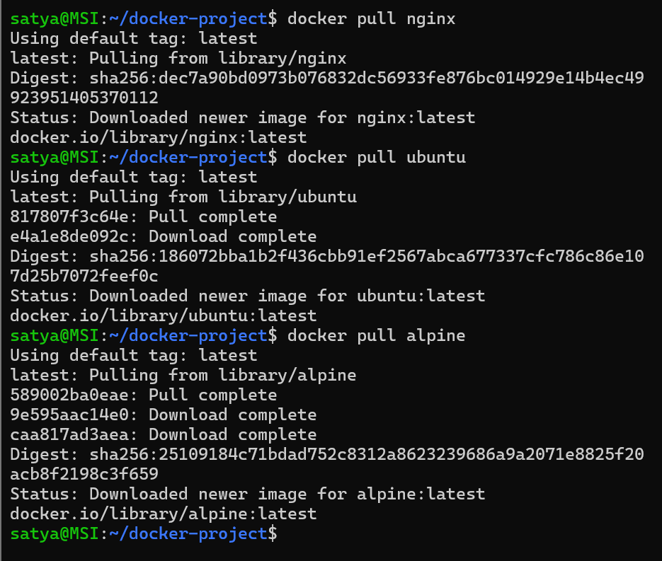
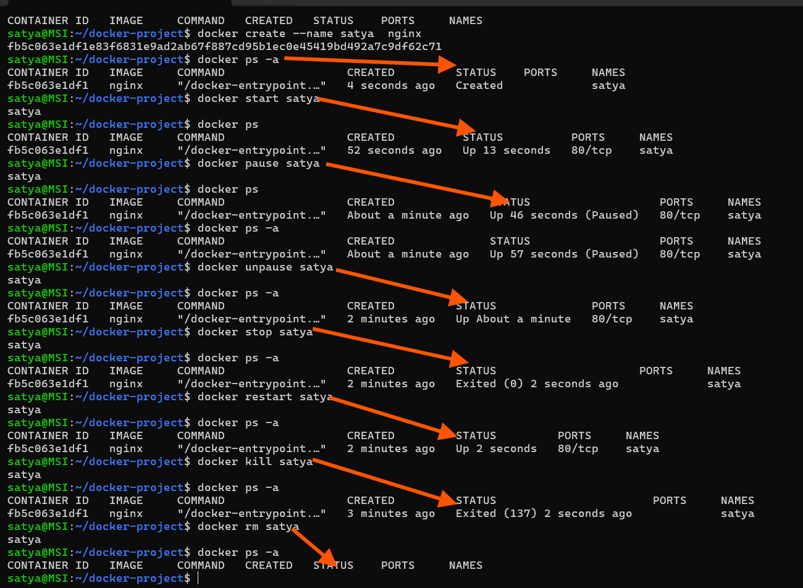

# Day 30 – Docker Images & Container Lifecycle

## Challenge Tasks

### Task 1: Docker Images
1. Pull the `nginx`, `ubuntu`, and `alpine` images from Docker Hub

2. List all images on your machine — note the sizes
.png)

| Image | Disk Size | 
|-------|-----------|
| nginx:latest | 240MB   |
| ubuntu:latest | 119MB  |
| alpine:latest | 13.1MB |

3. Compare `ubuntu` vs `alpine` — why is one much smaller?

|Feature|ubuntu:latest|alpine:latest|
|-------|-------------|--------------|
| Base OS | Ubuntu Linux | Alpine Linux |
| Size | 119MB | 13.1MB |
|Package Manager| APT | APK |
|Standard Library| glibc  | musl libc  |
| Ease of Use| Beginner-friendly | Slightly tricky | 
| Security Surface | Larger | Smaller (minimal) |

4. Inspect an image — what information can you see?
.png)

 - Image ID: "Id": "sha256:dec7a90bd0973b..."
 - Image: nginx:latest
 - "RepoDigests":"nginx@sha256:dec7a90bd0973b0..."
 - ExposedPorts": "80/tcp"
 - Repository: docker.io/library/nginx
 -    Environment variable
 -    NGINX Version: 1.29.6
 -    ENTRYPOINT
 -    CMD
 -    Lables,maintainer
 -    Filesystem | Uses layered filesystem | 7 layers

5. Remove an image you no longer need
    `docker rmi <image_id>` or `docker image rmi <image_name>`
.png)

---

### Task 2: Image Layers
1. Run `docker image history nginx` — what do you see?
    - A list of instructions used to build the nginx image (e.g., CMD, EXPOSE, ENTRYPOINT, COPY, RUN, ENV, LABEL) Each instruction corresponds to a layer.

.png)

2. Each line is a **layer**. Note how some layers show sizes and some show 0B
    - Layers showing 0B were created by instructions that only change metadata, such as ENV, CMD, EXPOSE, LABEL, or ENTRYPOINT.These do not change the filesystem.

3. Write in your notes: What are layers and why does Docker use them?
- Docker layers are read-only filesystem snapshots created by each instruction in a Dockerfile.
- Docker uses layers because:
    - They allow build caching (faster builds)
    - They allow images to share
 common layers (saves storage).
    - They make image downloads faster (only new layers are pulled)

---

### Task 3: Container Lifecycle
Practice the full lifecycle on one container:
1. **Create** a container (without starting it)
2. **Start** the container
3. **Pause** it and check status
4. **Unpause** it
5. **Stop** it
6. **Restart** it
7. **Kill** it
8. **Remove** it

Check `docker ps -a` after each step — observe the state changes.

---

### Task 4: Working with Running Containers
1. Run an Nginx container in detached mode
2. View its **logs**
3. View **real-time logs** (follow mode)
.png)
4. **Exec** into the container and look around the filesystem
.png)
5. Run a single command inside the container without entering it
    `docker exec <container_id> ls -l /usr/share/nginx/html`
.png)
6. **Inspect** the container — find its IP address, port mappings, and mounts
.png)

---

### Task 5: Cleanup
1. Stop all running containers in one command
   `docker stop $(docker ps -aq)`
   `docker rm $(docker ps -aq)`
   `docker rmi $(docker images -q)`
   `docker system prune -a` (removes all unused containers, networks, images (both dangling and unreferenced), and optionally, volumes)
   `docker system df` (shows disk usage)
   `docker image prune -a` (removes all unused images, not just dangling ones)
   `docker container prune` (removes all stopped containers)
   `docker volume prune` (removes all unused volumes)
   `docker network prune` (removes all unused networks)
   `docker system prune` (removes all unused containers, networks, images (both dangling and unreferenced), and optionally, volumes)
2. Remove all stopped containers in one command
   `docker rm $(docker ps -a -q)`
3. Remove unused images
.png)
   `docker rmi $(docker images -q)`

4. Check how much disk space Docker is using
    `docker system df` -check disk usage before cleanup
    `docker system prune -a` - remove all unused data
    `docker image prune -a` - removes all unused images
    `docker builder prune` - removes build cache
    `docker system df` - check disk usage after cleanup
    .png)

---