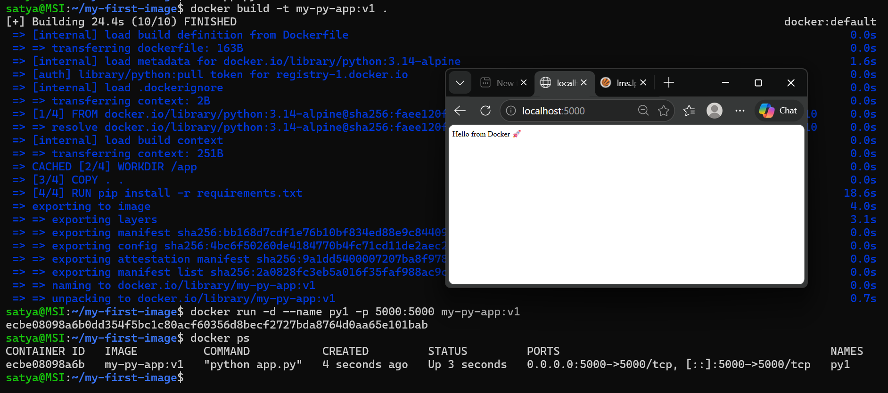
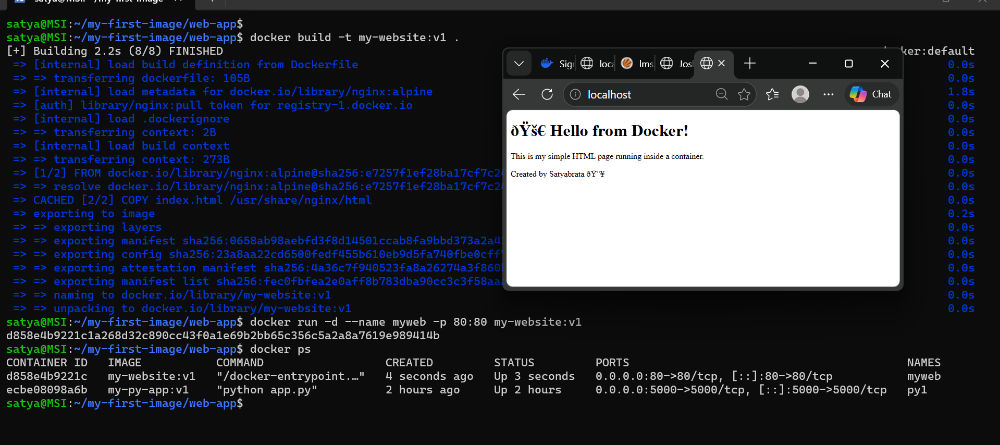
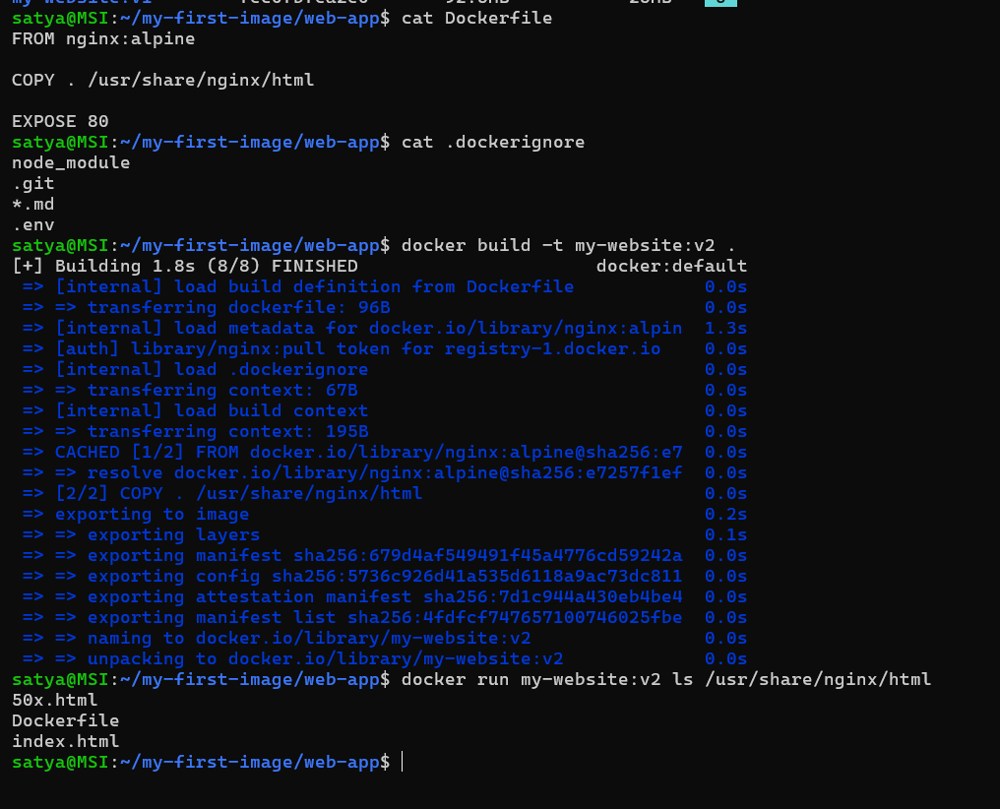

# Day 31 – Dockerfile: Build Your Own Images

## Challenge Tasks

### Task 1: Your First Dockerfile
1. Create a folder called `my-first-image`
2. Inside it, create a `Dockerfile` that:
   - Uses `ubuntu` as the base image
   - Installs `curl`
   - Sets a default command to print `"Hello from my custom image!"`
3. Build the image and tag it `my-ubuntu:v1`
.png)
4. Run a container from your image
.png)
**Verify:** The message prints on `docker run`

---

### Task 2: Dockerfile Instructions
Create a new Dockerfile that uses **all** of these instructions:
- `FROM` — base image : `FROM python:3.14alpine`: This sets the base image to Python 3.14 on Alpine Linux, which is a lightweight distribution.
- `RUN` — execute commands during build 
- `COPY` — copy files from host to image
- `WORKDIR` — set working directory
- `EXPOSE` — document the port
- `CMD` — default command

Build and run it. Understand what each line does.

---

### Task 3: CMD vs ENTRYPOINT
1. Create an image with `CMD ["echo", "hello"]` — run it, then run it with a custom command. What happens?
.png)

    - Run without arguments: The container runs the default command echo hello and outputs: `hello`.

    - Run with a custom command: When you run the container with a custom command (e.g., echo "custom command"), the custom command completely overrides the CMD, so the output is: `custom command`. The original CMD is ignored.

2. Create an image with `ENTRYPOINT ["echo"]` — run it, then run it with additional arguments. What happens?
.png)
    - Run without arguments: The container runs echo with no arguments,resulting in a blank line (no output).

    - Run with additional arguments: When you pass arguments (e.g., `hello-world`), they are appended to the ENTRYPOINT, so it runs echo `hello-world` and outputs: `hello-world`.    

3. Write in your notes: When would you use CMD vs ENTRYPOINT?
    - Use CMD when you want to provide a default command that can be changed easily when you run the container.

    - Use ENTRYPOINT when you want to set a fixed command that always runs, and you want to allow additional arguments to be passed in.

---

### Task 4: Build a Simple Web App Image
1. Create a small static HTML file (`index.html`) with any content
2. Write a Dockerfile that:
   - Uses `nginx:alpine` as base
   - Copies your `index.html` to the Nginx web directory
3. Build and tag it `my-website:v1`
4. Run it with port mapping and access it in your browser

---

### Task 5: .dockerignore
1. Create a `.dockerignore` file in one of your project folders
2. Add entries for: `node_modules`, `.git`, `*.md`, `.env`
3. Build the image — verify that ignored files are not included

---

### Task 6: Build Optimization
1. Build an image, then change one line and rebuild — notice how Docker uses **cache**
.png)
    - When you change a line in the Dockerfile, Docker will reuse the cached layers up to the point of the change. After that, it will rebuild all subsequent layers. This is why changing an early line causes more layers to be rebuilt, while changing a later line results in fewer layers being rebuilt.

2. Reorder your Dockerfile so that frequently changing lines come **last**
.png)
    - By placing frequently changing lines towards the end of the Dockerfile, you can take advantage of Docker's caching mechanism. This way, when you make changes to those lines, only the layers after them will need to be rebuilt, which can significantly speed up the build process.

3. Write in your notes: Why does layer order matter for build speed?
    - Docker builds images in layers and caches each layer.
    - If a layer changes,Docker rebuilds that layer and all layers after it.
 - By placing: 
    - Rarely changing files (dependencies) first
    - Frequently changing files (source code) last
    - Docker can reuse cached layers,resulting in faster rebuilds.
---
