# Day 33 – Docker Compose: Multi-Container Basics

## Task
Today's goal is to **run multi-container applications with a single command**.

Yesterday you manually created networks and volumes and ran containers one by one. Docker Compose does all of that in one YAML file.

---

## Challenge Tasks

### Task 1: Install & Verify
1. Check if Docker Compose is available on your machine
2. Verify the version
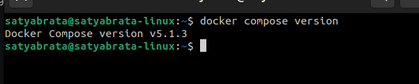 

--- 

### Task 2: Your First Compose File
1. Create a folder `compose-basics`
2. Write a `docker-compose.yml` that runs a single **Nginx** container with port mapping
3. Start it with `docker compose up`
4. Access it in your browser
5. Stop it with `docker compose down`
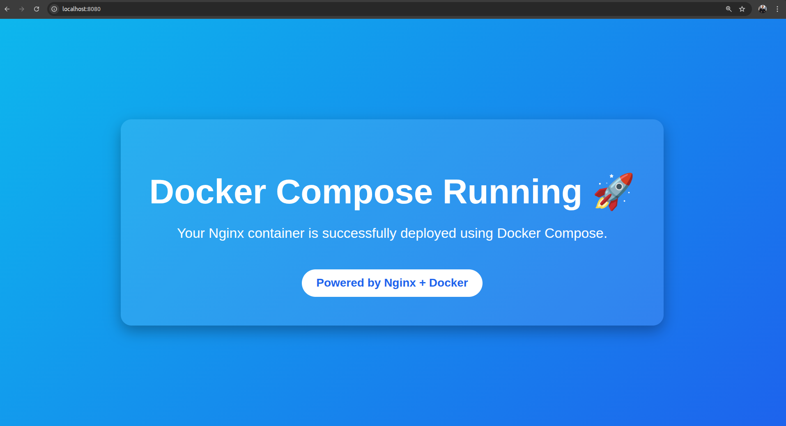

[Compose File](compose-basics/docker-compose.yml)
[Compose File](compose-basics/docker-compose.yml)
[HTML](compose-basics/index.html)

---

### Task 3: Two-Container Setup
[Compose File](wordpress-compose/docker-compose.yml)
Write a `docker-compose.yml` that runs:
- A **WordPress** container
- A **MySQL** container

They should:
- Be on the same network (Compose does this automatically)
- MySQL should have a named volume for data persistence
- WordPress should connect to MySQL using the service name

Start it, access WordPress in your browser, and set it up.

**Verify:** Stop and restart with `docker compose down` and `docker compose up` — is your WordPress data still there?
- Yes,wordpress data is still there.

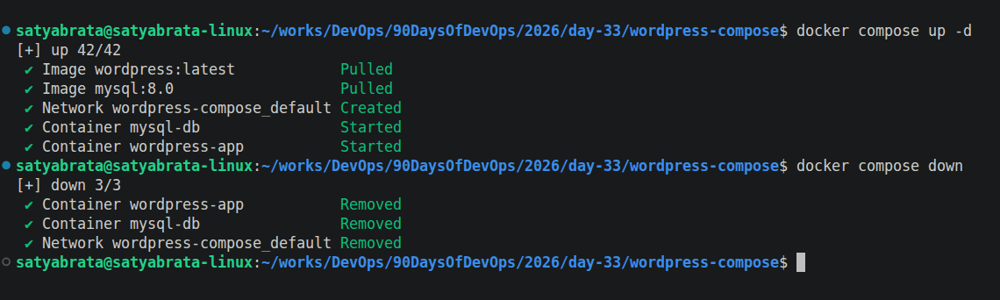
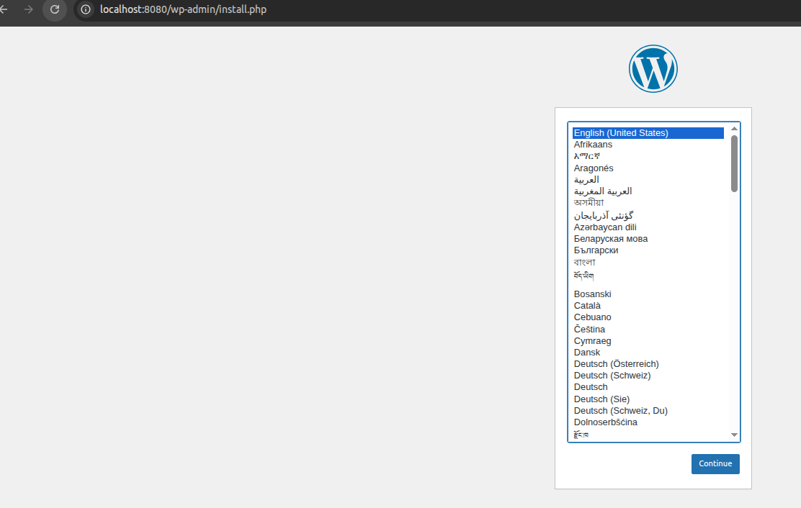
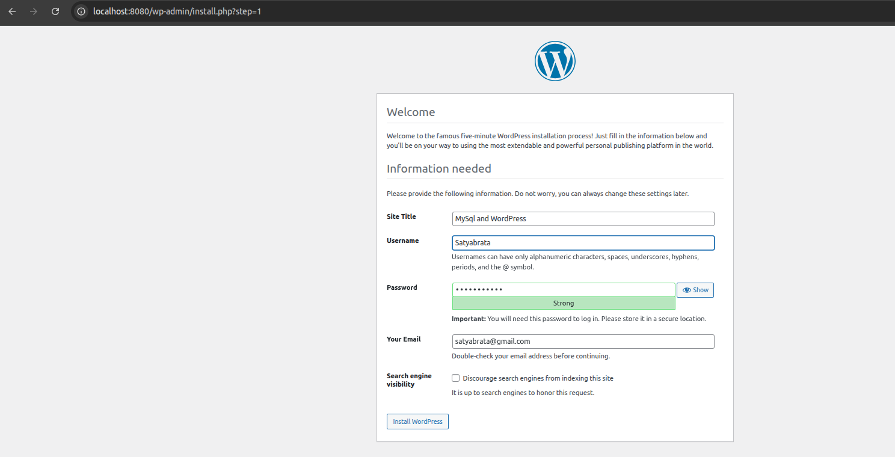
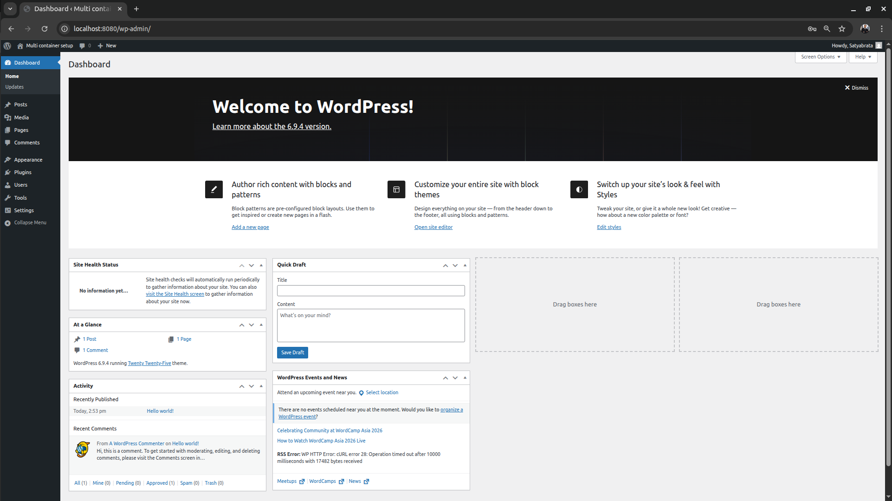

---

### Task 4: Compose Commands

[Compose File](wordpress-compose/docker-compose.yml)

Practice and document these:
1. Start services in **detached mode**
'docker compose up -d' 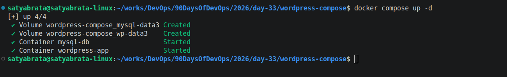
2. View running services
'docker compose ps' 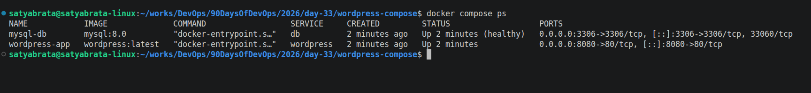
3. View **logs** of all services
'docker compose logs' 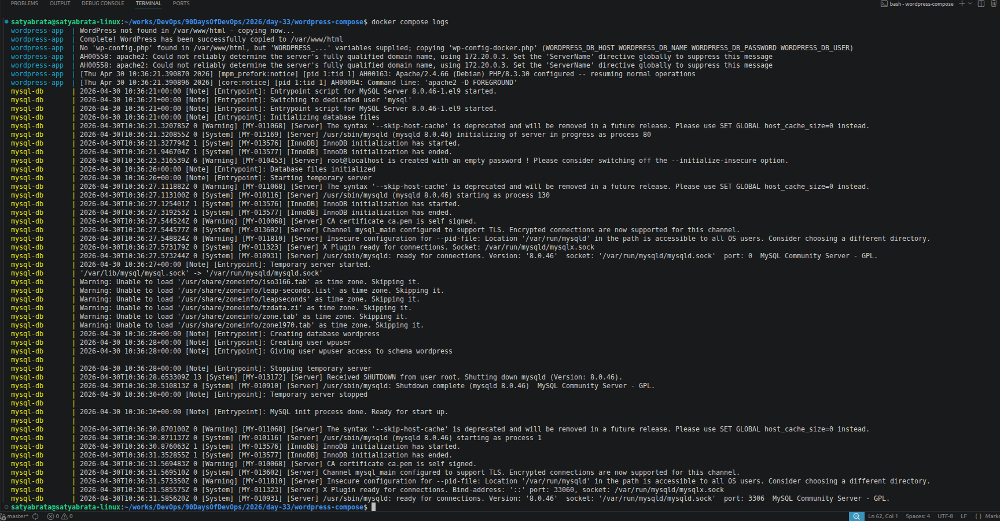
4. View logs of a **specific** service
'docker compose logs <service_name>' 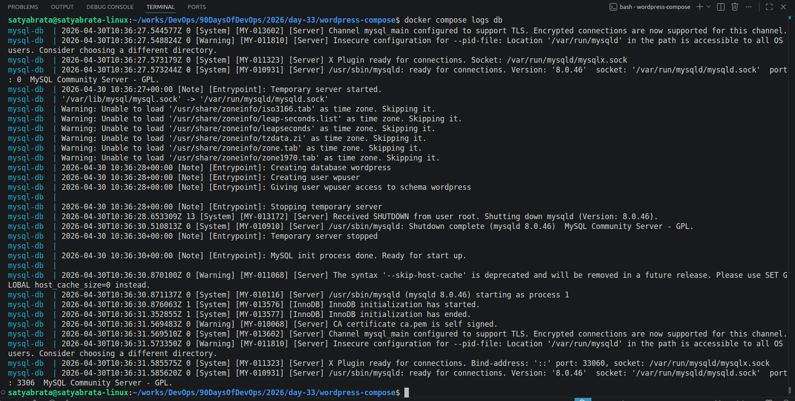
5. **Stop** services without removing
'docker compose stop' 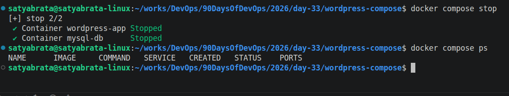
6. **Remove** everything (containers, networks)
'docker compose down' 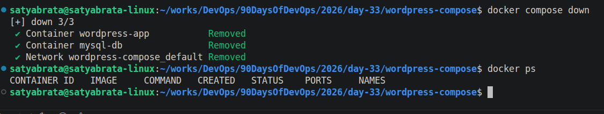
7. **Rebuild** images if you make a change
'docker compose up --build' 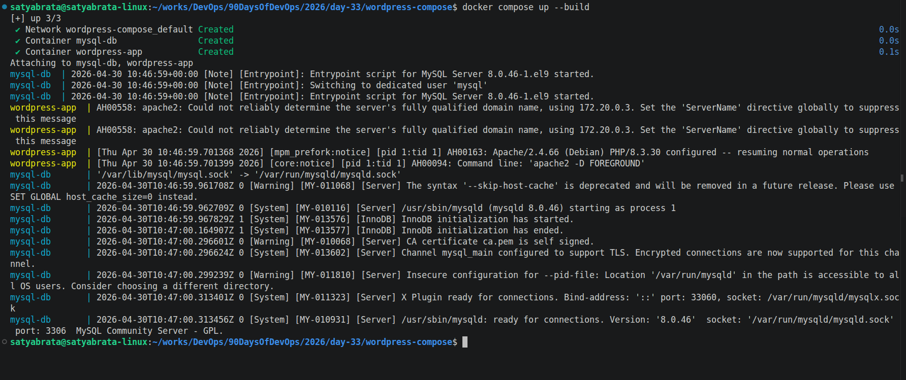

### Task 5: Environment Variables
1. Add environment variables directly in your `docker-compose.yml`
2. Create a `.env` file and reference variables from it in your compose file
3. Verify the variables are being picked up
[Environment Variables](wordpress-compose-env/.env)
[Compose File](wordpress-compose-env/docker-compose.yml)
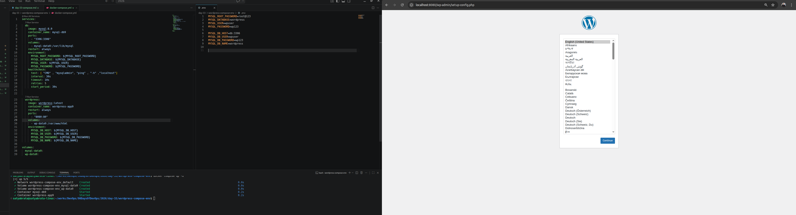

---

## Hints
- Start: `docker compose up -d`
- Stop: `docker compose down`
- Logs: `docker compose logs -f`
- Compose creates a default network for all services automatically
- Service names in compose are the DNS names containers use to talk to each other