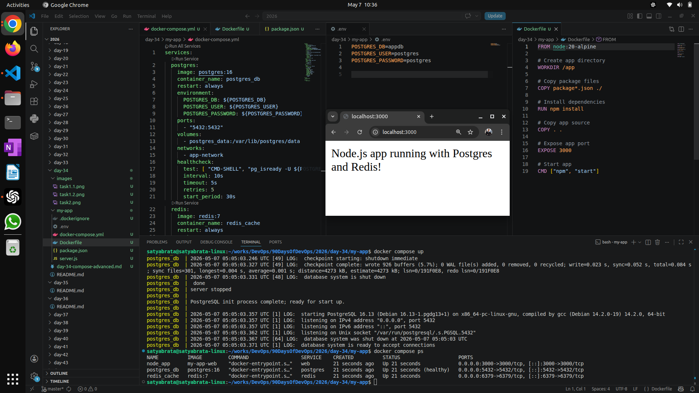
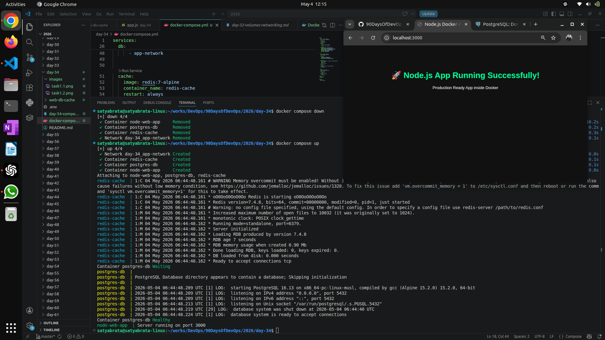
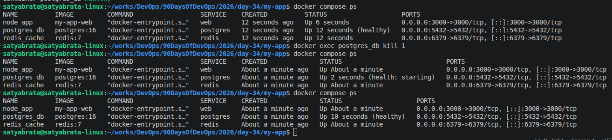
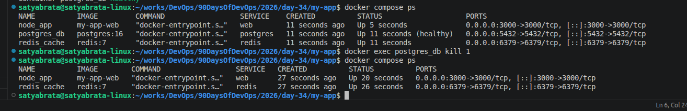
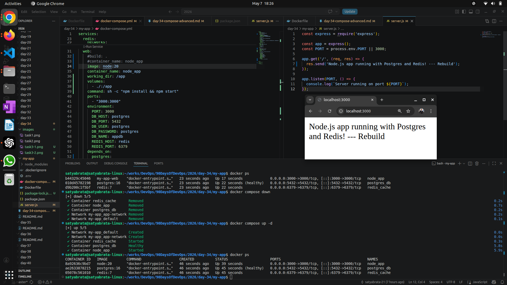
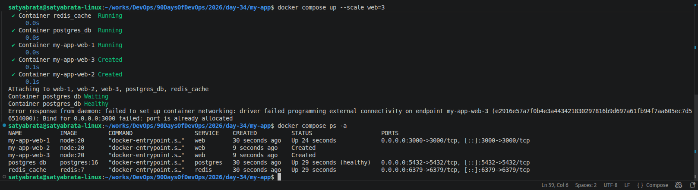

# Day 34 – Docker Compose: Real-World Multi-Container Apps

## Task
Today's goal is to **build more complex, production-like setups with Docker Compose**.

Yesterday was basics. Today you handle real scenarios — app + database + cache, healthchecks, restart policies, and service dependencies.

---

## Challenge Tasks

### Task 1: Build Your Own App Stack
Create a `docker-compose.yml` for a 3-service stack:
- A **web app** (use Python Flask, Node.js, or any language you know)
- A **database** (Postgres or MySQL)
- A **cache** (Redis)

    [Code Example](my-app/)
    

Write a simple Dockerfile for the web app. The app doesn't need to be complex — even a "Hello World" that connects to the database is enough.

---

### Task 2: depends_on & Healthchecks
1. Add `depends_on` to your compose file so the app starts **after** the database
2. Add a **healthcheck** on the database service
3. Use `depends_on` with `condition: service_healthy` so the app waits for the database to be truly ready, not just started

**Test:** Bring everything down and up — does the app wait for the DB?

    - Postgres container starts first.
    - Healthcheck waits until DB is ready.
    - App container starts only after DB is healthy.

 

---

### Task 3: Restart Policies

1. Add `restart: always` to your database service

    

2. Manually kill the database container — does it come back?
    - Yes, it back.
3. Try `restart: on-failure` — how is it different?
    - No restart.
    

4. Write in your notes: When would you use each restart policy?
    `restart:always` Use When: Databases, Backend APIs, Production services, Anything that must always run

r   `estart:on-failure` Use When: Data processing jobs One-time migration scripts
---

### Task 4: Custom Dockerfiles in Compose
1. Instead of using a pre-built image for your app, use `build:` in your compose file to build from a Dockerfile
2. Make a code change in your app
3. Rebuild and restart with one command
    [Dockerfile](my-app/Dockerfile)  
    

---

### Task 5: Named Networks & Volumes
1. Define **explicit networks** in your compose file instead of relying on the default
2. Define **named volumes** for database data
3. Add **labels** to your services for better organization
  [Compose](my-app/docker-compose.yml)   
  
---

### Task 6: Scaling (Bonus)
1. Try scaling your web app to 3 replicas using `docker compose up --scale`
2. What happens? What breaks?
3. Write in your notes: Why doesn't simple scaling work with port mapping?
   

---

## Hints
- Build from Dockerfile: `build: ./app`
- Healthcheck: `healthcheck:` with `test`, `interval`, `timeout`
- Rebuild: `docker compose up --build`
- Scale: `docker compose up --scale web=3`

---

## Resources
- [Docker Compose Documentation](https://docs.docker.com/compose/)
- [Docker Compose File Reference](https://docs.docker.com/compose/compose-file/)
- [Docker Compose CLI Reference](https://docs.docker.com/compose/cli-command/)
- [Docker Compose Best Practices](https://docs.docker.com/compose/best-practices/)
- [Docker Compose Examples](https://github.com/docker/awesome-compose)  